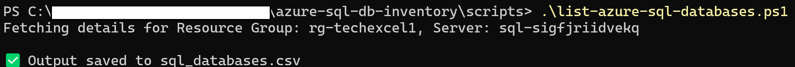
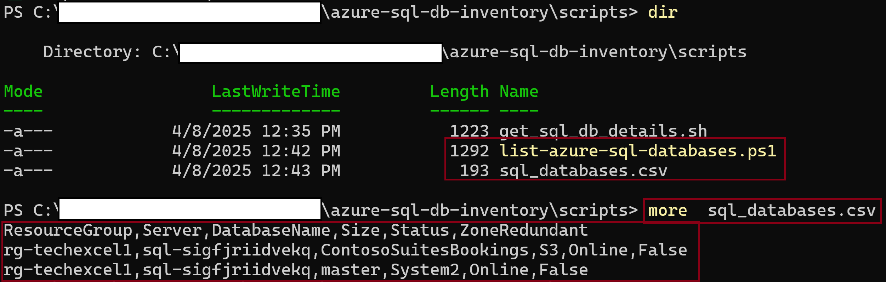

# 🔍 Azure SQL Database Inventory Script

This powershell script leverages the Azure CLI to inventory all **Azure SQL Databases** in your subscription. It organizes the databases by **SQL server** and **resource group**, and displays useful details such as service tier, current status, and zone redundancy.

Ideal for cloud administrators, DevOps engineers, or developers managing large-scale Azure environments.

---

## 📋 Features

- ✅ Lists all Azure SQL Databases across your subscription
- 🗂️ Groups databases by their parent SQL server and resource group
- 📊 Displays database service tier, status, and zone redundancy in a clean table format
- 🔁 Uses standard CLI tools
- 🧩 Easily customizable for filtering, CSV export

---

## 📦 Pre-requisites

To use this script, you'll need the following installed:
- **Git**  
  [Install instructions](https://git-scm.com/downloads)

- **Azure CLI**  
  [Install instructions](https://learn.microsoft.com/en-us/cli/azure/install-azure-cli)

- **Login to your Azure account** before running the script:
  ```bash
  az login

- **✅ Minimum Role Required**
  To run your script successfully, a user needs at least the Reader role at the subscription level plus visibility into the SQL resources.

  Specifically, they need permission to:
  - List Azure resources (for az resource list)
  - List SQL servers and databases (for az sql db list)
---

## 🚀 Getting Started
- **🔧 1. Clone the repository**

      git clone https://github.com/misantibanez/azure-sql-db-inventory.git
      cd azure-sql-db-inventory
    
- **▶️ 2. Run the script**

      cd scripts
      az login
      .\list-azure-sql-databases.ps1
    

---

## 🖥️ Example Output
    
    Fetching details for Resource Group:

  

---
## 🔗 References

- [Azure CLI Documentation](https://learn.microsoft.com/en-us/cli/azure/)
- [Install Azure CLI](https://learn.microsoft.com/en-us/cli/azure/install-azure-cli)
- [Azure CLI `az resource list`](https://learn.microsoft.com/en-us/cli/azure/resource#az-resource-list)
- [Azure CLI `az sql db list`](https://learn.microsoft.com/en-us/cli/azure/sql/db#az-sql-db-list)
- [Azure Built-in Roles: Reader](https://learn.microsoft.com/en-us/azure/role-based-access-control/built-in-roles#reader)
- [Azure Built-in Roles: Contributor](https://learn.microsoft.com/en-us/azure/role-based-access-control/built-in-roles#contributor)
- [Azure Role-Based Access Control (RBAC)](https://learn.microsoft.com/en-us/azure/role-based-access-control/overview)

---
## 🛠️ Troubleshooting

If you encounter any issues, here are some common solutions:

1. **Error: "Unable to authenticate"**
   - Ensure you've run `az login` and that you have the necessary permissions for the subscription.

2. **Error: "Command not found"**
   - Make sure you've installed the Azure CLI and are running the script in the correct environment (Bash or PowerShell).
   
3. **Output not as expected**
   - Ensure your subscription contains SQL databases and that the `az sql db list` command is functioning properly.

For more help, refer to the [Azure CLI troubleshooting guide](https://learn.microsoft.com/en-us/azure/azure-cli-logging-troubleshoot).
